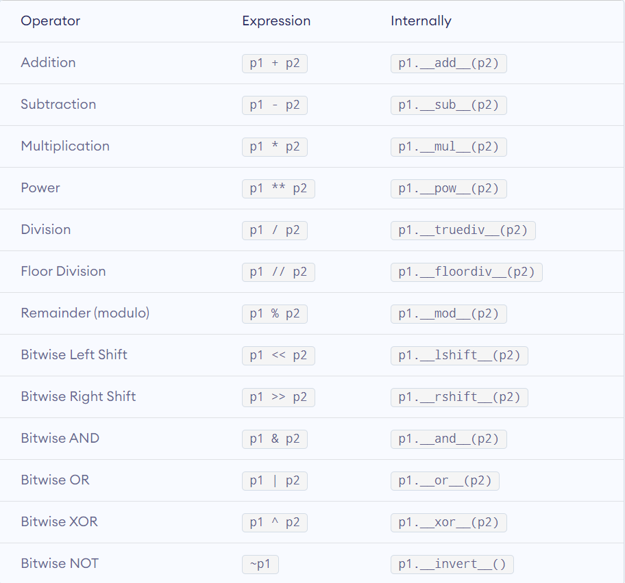

# Language Explorations

## What's it for?

This repo is used to explore key differences in behaviors and syntaxes among following languages:

- C++
- Java
- Python
- Javascript

The contents will be added to the collection as they come to mind.

Hopefully, this collection can also be used as cheatsheet or reference for above languages.

General structures of the repo:
```
ROOT
├ README.md  
├ .gitignore
├─── CPP
│    ├ feature1.cpp
│    ├ feature2.cpp 
│    ...
├─── Java
│    ├ feature1.java
│    ├ feature2.java
│    ... 
├─── Python
│    ├ feature1.py
│    ├ feature2.py
│    ... 
└─── Javascript
     ├ feature1.js
     ├ feature2.js
     ... 
```
---

## Navigation

*Needs refactors/re-ordering after more contents are added*

- [Fundamentals](#fundamentals) *(Syntax/Features)*
    - [For Loops](#for-loops)
    - [Higher-Order For Loops](#higher-order-for-loops)
    - [Arrays](#arrays)
    - [Strings](#strings)
    - [Generic Types](#generic-types)
    - [Operator Overloading](#operator-overloading)
    - [Exceptions](#exceptions)

- [Built-in Data Structures](#built-in-data-structures)
    - [Dynamic-sized Array](#dynamic-sized-array)
    - [Set](#set)
    - [Stack](#stack)
    - Queue
    - Map/Dictionary
    - Hashtable

- [Procedural](#procedural)
    - [Pass By Value vs Reference](#pass-by-value-vs-reference)
    - Lambda Functions
    - Callback Functions
    - Default Parameters
    - Function Overloading

- [Object-Oriented](#object-oriented)
    - Access Modifiers
    - Encapsulation
    - Inheritance
    - Polymorphism

    ... More to Come

---

## Fundamentals

---

## For Loops

- **C++ / Java**

    *for (`type` `name` : `iterable`)*

    Basic Counter Loop (Index-based):
    ```c++
    for (int i = 0; i < sizeOfIterable; i++) {
        // code to play with iterable[i]
    }
    ```
    Range-based Loop (Element-based):
    ```c++
    // In C++, auto can be used to let compiler determine the type based on the iterable
    for (auto value : iterable) {
        // code to play with each value directly
    }
    ```

    [**Java Example**](Java/ForLoops.java)

- **Python**

    *for `name` in `iterable`*

    **Technically, Python does not have counter-based for-loop**

    *But combined with range(), which returns list of numbers, we can achieve basic counter loop as below*

    Basic Counter Loop (Index-based):
    ```python
    for i in range(len(iterable)):
        print(iterable[i])
    # range(start, end, step)
    # returns list of numbers from <start>(inclusive) to <end>(exclusive) with <step> increment
    ```

    Range-based Loop (Element-based):
    ```python
    for elem in iterable:
        print(elem)
    
    # also able to unpack tuple (multiple returns)
    for key, value in dict.items():
        print("key: {0}, value: {1}".format(key, value))
    # by convention, unpack unnecessary value with "_"
    for a, b, c, _ in tuple:
        print(a + b + c)
    ```

    Enumeration:
    ```python
    # using enumerate() to access both index and value
    for index, value in enumerate(arr):
        print(index, value)
    ```

    [**Python Example**](Python/for-loop.py)

- **Javascript**

    *for (let `name` in `iterable`)*
    
    *for (let `name` of `iterable`)*

    Basic counter Loop (Index-based):
    ```javascript
    for (let i = 0; i < iterable.length; i++) {
        console.log(iterable[i])
    }
    // Caution: unlike Python, below syntax (for...in...) accesses index, not values.
    for (let i in iterable) {
        console.log(iterable[i])
    }
    ```
    Range-based Loop (Element-based):
    ```javascript
    for (let element of iterable) {
        console.log(element)
    }
    ```

    [**Javascript Example**](Javascript/for-loop.js)

[**Back to Top**](#navigation)

---

## Higher-Order For Loops

**Some Common Higher-Order For Loops:**

**FOR EACH:** generally used to access each element (equivalent to range-based for-loop)

**MAP:** perform an operation on each element (modification)

**FILTER:** returns subset of elements that satisfy condition

**REDUCE:** computes a result by iterating over elements

- **C++**

    C++'s `<algorithm>` library includes following:
    - `transform`: equivalent to map.
    - `copy_if`: filter and create new copied list.
    - `remove_if`: filter and remove elements in place.

    `<numeric>` library:
    - `accumulate`: reduce, sequential only (slower, but in order)
    - `reduce`: reduce, parallelism allowed (faster, but incorrect in non-associate or non-commutative operations like subtract, divide, etc)

        *reduce's advantage execution policy requires tbb dependency*

    [**CPP Example**](CPP/higherOrderForLoop.cpp)

- **Java**

    Java's `Stream` Object has methods:
    - `map`: `Stream.map(element -> do_something)`
    - `filter`: `Stream.filter(element -> some_condition)`
    - `sum`: `Stream.sum()`
    - `average`: `Stream.average()`
    - `count`: `Stream.count()`
    - `reduce`: `Stream.reduce(accumulator, function(current, next))`
    
    `Java.util.Collection` has `stream` method to convert `Collection` to `Stream`,

    and `Arrays` class has `stream` method to convert any array into `Stream`

    [**Java Example**](Java/HigherOrderForLoop.java)

- **Python**

    Python has built-in higher-order functions:
    - `map(function, list)`
    - `filter(function, list)`
    - `reduce(function, list, accumulator)`

    [**Python Example**](Python/higherOrderForLoop.py)

- **Javascript**

    Javascript's higher-order functions include:
    - `forEach(function(element[, index[, array]]))`: returns `undefined`. In-place, so **generally** not used for modification.
    - `map(function(element[, index[, array]]))`: returns new list after the transformation
    - `filter(function(element[, index[, array]]))`: returns new list that satisfy conditions
    - `reduce(function(accumulator, element[, index[, array]]), initialAccValue)`: returns the accumulated result
    
    and much more like: `find()`, `every()`, `some()`, `includes()`, `findIndex()`, etc.

    [MDN Array Doc](https://developer.mozilla.org/en-US/docs/Web/JavaScript/Reference/Global_Objects/Array)

    [**Javascript Example**](Javascript/higherOrderForLoop.js)

[**Back to Top**](#navigation)

---

## Arrays

Array is a collection, or a list, of items.

- **C++**

    - static size: size needed at compile time
    - "items" must be of the same type
    - No warning for out of range (simply access/modify the data in that memory block)
    - Not really an object, merely placed in contiguous memory blocks

    [**CPP Example**](CPP/Array.cpp)

- **Java**

    - static size: size needed at compile time
    - "items" must be of the same type
    - Throws `ArrayIndexOutOfBoundsException` when trying to access beyond initial size
    - `java.util.Arrays` provides array methods

    [**Java Example**](Java/Array.java)

- **Python**
    
    Provides [array module](https://docs.python.org/3/library/array.html): single datatype + dynamic size + array methods

    But generally utilizes `list` - a much more flexible option

    - dynamic size
    - allow different datatypes
    - list slicing (ex. `list[2:5]`)
    - list comprehension (ex. `[x for x in list if x > 5]`)
    - list methods (ex. `append()`, `insert()`, `extend()`, `pop()`, `remove()`, `sort()`, `reverse()`, etc)

    [**Python Example**](Python/Array.py)

- **Javascript**

    - dynamic size
    - allow different datatypes
    - array methods (ex. `push()`, `pop()`, `slice()`, `unshift()`, `sort()`, etc)  
    - Similar to Python's list, so no separate example

[**Back to Top**](#navigation)

---

## Strings

- **C++**

    - C-string is array of chars delimited by `\0` (or pointer to contiguous block of chars) `char str[5]` or `char* str`
    - string STL is commonly used instead.
    - string is simply a safe wrapper for C-string, so is mutable.
    - string library overloads `+` as concatenation and provides useful methods.

    [**CPP Example**](CPP/Strings.cpp)

- **Java / Python / Javascript**

    - Immutable, any modifications create a new instance.
    - (Java) The same string literal does not create new instance of string. (variables reference the same string literal in the string pool)
    - (Java) `equals()` checks for string's value equality. `==` is true only if two references "point" to the same object

    [**Java Example**](Java/Strings.java)

[**Back to Top**](#navigation)

---

## Generic Types

Generic types allow reusability of code using different datatypes.

Common use case: Function that takes different datatypes (saves function overloading for each datatype), User-defined class or data structures.

- **C++**

    - Uses template.

    - Behind the scene, C++ macro creates class/function automatically for each datatypes, including user-defined datatypes.

    [**CPP Example**](CPP/GenericType.cpp)

- **Java**

    - Allows compile-time type safe check. If the generic code has, for example, "==" comparison, it will not compile, as some types do not support "==" operator.

    [**Java Example**](Java/GenericType.java)
    
    [**User-defined Generic Datatype**](Java/Node.java)

- **Python / Javascript**

    - As datatypes bind dynamically, there's no need of generic type.

[**Back to Top**](#navigation)

---

## Operator Overloading

Operator overloading allows re-define the behavior of built-in operators such as, <<, >> (C++), =, ==, +, - ...

- **C++**

    - Supports operator overloading.

    - [list of overloadable operators](https://en.cppreference.com/w/cpp/language/operators)

    - Use keyword `operator`.

    [**CPP Example**](CPP/OperatorOverloading.cpp)

- **Python**

    - Allows operator overloading by overloading methods like `__str__`, `__add__`, `__sub__`, etc

    
    [Image Source](https://www.programiz.com/python-programming/operator-overloading)

    [**Python Example**](Python/OpOverload.py)

- **Java / Javascript**

    - Does not support operator overloading.
    - (JS) prototypes can be modified, but discouraged.

[**Back to Top**](#navigation)

---

## Exceptions

Exceptions are thrown when program runs into an error, or a condition that programmer considers as an exception. (ie. DividedByZero, IndexOutOfBounds...)

A caller can try a function that throws exceptions, and catch those exceptions and perform differently based on the exception thrown. (Or program terminates with exception)

- **C++**

    - `throw`, `try`, `catch`
    - Can throw any data type.
    - Unchecked Exceptions only.
    - `<stdexcept>` includes some standard exception objects.

    [**CPP Example**](CPP/Exceptions.cpp)

- **Java**

    - `throw`, `try`, `catch`, `finally`
    - Only throw Throwable Object (like implementations of Exception or Error).
    - Checked and Unchecked Exceptions. [Explanation](https://www.tutorialspoint.com/Checked-vs-Unchecked-exceptions-in-Java)

    [**Java Example**](Java/Exceptions.java)

- **Python**

    - `raise`, `try`, `except` , `else`, `finally`

    [**Python Example**](Python/Exceptions.py)

- **Javascript**

    - `throw`, `try`, `catch`, `finally`
    - Can throw any data type.

    [**Javascript Example**](Javascript/Exceptions.js)

[**Back to Top**](#navigation)

---

## Built-in Data Structures

---

## Dynamic-sized Array

- **C++**

    - Using STL `std::vector`: vector also provides useful array methods.

    [**CPP Example**](CPP/DynamicArray.cpp)

- **Java**

    - Using `java.util.List` implementations such as `java.util.ArrayList`

    [**Java Example**](Java/DynamicArray.java)

- **Python / Javascript**

    - The built-in list/array itself is dynamic sized, and do not require additional library.

[**Back to Top**](#navigation)

---

## Set

Set is a collection of unique data (main trait: does not allow duplicates).

- **C++**

    - By default, sorted unless using `unordered_set`.
    - `set` has underlying binary search tree, so `std::set::find` is more efficient than generic `std::find`.

    [**CPP Example**](CPP/Set.cpp)

- **Java**

    - `Set` is merely an interface in Java.
    - Commonly used implementations of `Set` interface:
        1. `HashSet`: Not sorted, order is undefined.
        2. `LinkedHashSet`: Retains order as elements are inserted (ordered by insertion order).
        3. `TreeSet`: Sorted. Uses self-balancing tree structure internally.
    - Easy to perform set operations (intersection, union, difference) using `retainAll()`, `addAll()`, `removeAll()` respectively.
    
    [**Java Example**](Java/Sets.java)

- **Python**

    - Can be initialized using either `{}` or `set()` constructor.

    - Python's set is unordered.

    - Even easier than Java to perform set operations as Python provides built-in methods for set operations: `intersection()`, `union()`, `difference()`, `symmetric_difference()`, etc.

    [**Python Example**](Python/Set.py)

- **Javascript**

    - Initialized using `Set()` constructor.
    - Retains the insertion order.
    - Does not have built-in Set operations, but can be implemented using `has()`, `add()`, `delete()`.

    [**Javascript**](Javascript/Set.js)

[**Back to Top**](#navigation)

---

## Stack

Stack is a LIFO (Last-In-First-Out) data structure. Some applications are: undo feature, balance check, etc.

- **C++**

    - STL provides `<stack>`.

    [**CPP Example**](CPP/Stack.cpp)

- **Java**

    - `java.util.Stack` (implements Iterable, Collection, List)
    
    [**Java Example**](Java/StackExample.java)

- **Python/Javascript**

    - Do not have separate built-in stack, but array (list) has stack methods, so the array (list) can be used as a stack.

[**Back to Top**](#navigation)

---

## Procedural

---

## Pass By Value vs Reference

- **C++**

    C++ passes arguments by both value and reference, and the programmer has the freedom to make a choice based on the requirement.

    [C++ Example](CPP/pass-by.cpp)

- **Java/ Python/ Javascript**

    Uses pass-by-value, but when passing an object, the reference to the object is passed as value, allowing the object mutation. (This is also called as `pass-by-object-reference`)

    [Python Example](Python/pass-by.py)

[**Back to Top**](#navigation)

---

## Object-Oriented

---